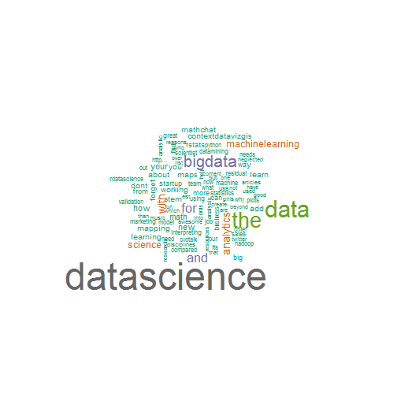

 
---
## Word Cloud for Twitters
1. Get most used words in 1000 Twitters for a specific Keyword
2. Present the word cloud for the 1000 Twitters
3. Manipulate the word cloud using sidebar.
Link: [Word Cloud for Twitters](http://wt2pku.shinyapps.io/wordCloudTwitter)

---


## Setting a Keyword
Set a keyword in the textInput.

```r
library(shiny)
textInput("selection", "Input a keyword, then hit 'Change' Button:",  "dataScience")
```
Search through Twitter API first.

```r
setup_twitter_oauth(api_key,api_secret,access_token,access_token_secret)
# Search the tweets using the keyword
tweets <- searchTwitter(keyword, 1000, lang="en")
```

---


## Get the Word Cloud
Here is the process for getting Twitters for keyword **dataScience**


```r
  wordcloud_rep <- repeatable(wordcloud);v <- getTermMatrix("dataScience")
  wordcloud_rep(names(v), v, scale=c(4,0.5), min.freq = 5, max.words=100, colors=brewer.pal(8, "Dark2"))
```

 

---

## Manipulate the word cloud
You can also change the Minimum Frequency of the word and Maximum Number of Words in word cloud using the sidebar


```r
sliderInput("freq", "Minimum Frequency:", min = 1,  max = 50, value = 5),
sliderInput("max",  "Maximum Number of Words:",  min = 1,  max = 300,  value = 50)
```

Time to experience [Word Cloud for Twitters](http://wt2pku.shinyapps.io/wordCloudTwitter)!
----


